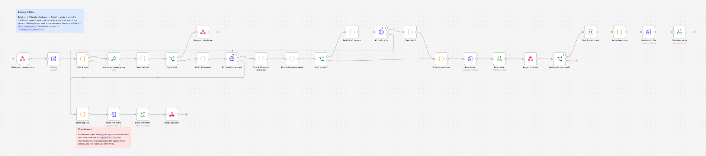
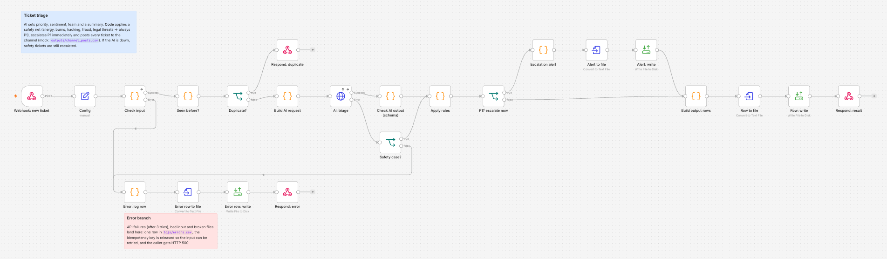
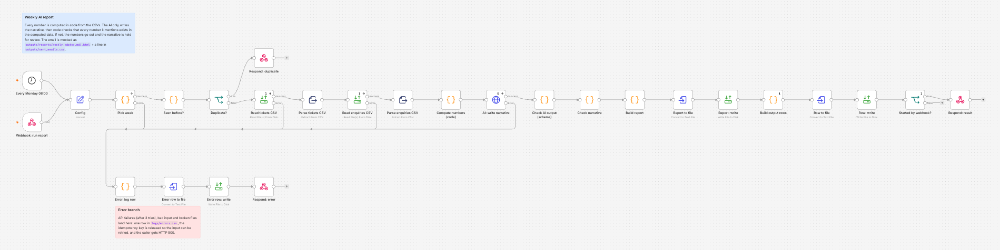
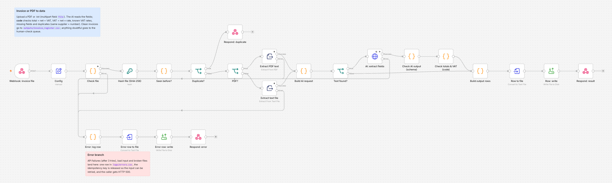
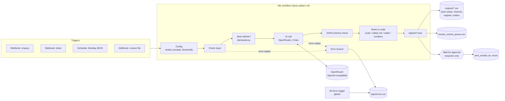

# AI workflow pack (n8n + AI)

Four n8n workflows that hand routine back-office work to an AI model (enquiries, support tickets, a weekly report and supplier invoices) while code checks every AI answer, a person approves anything customer-facing, and failures are logged rather than lost.

> **Status (8 October 2026): first version, generated by a coding agent from Sara's brief, not yet reviewed by Sara.** The workflows have run end to end in a local n8n (2.35.7) against a mock model, and with a real model (`openai/gpt-6-luna` via OpenRouter) on all 200 test inputs through the Python reference and on 40 inputs through n8n. See [Results](#5-results).

## 1. Demo

- **Video:** pending. Sara will record it: each workflow on 2 inputs, with one error caught and one item sent to human approval.
- **Canvas screenshots** were taken from the local n8n editor (`docs/screenshots/`):

| Enquiry intake | Ticket triage |
|---|---|
|  |  |
| **Weekly AI report** | **Invoice or PDF to data** |
|  |  |

## 2. The problem

The company in this demo is **Lumi Skin**, a fictional mid-size skincare retailer in Dubai with an online shop and wholesale customers. Its operations team spends hours every week on four jobs:

- sorting the shared inbox and replying to it;
- triaging support tickets;
- building the Monday report;
- typing supplier invoices into a register.

An AI model can do much of this work, but only if a team can trust it:

- it must not send an email nobody checked;
- it must not invent a number in a management report;
- it must not book the same invoice twice;
- it must not drop a ticket because an API was down.

This pack shows one way to get the time savings with those safeguards. It is also written up so an operations team could run it: an SOP, a staff training guide and an hours-saved estimate.

## 3. What it does

1. **Enquiry intake.** An email arrives at a webhook.
   - The AI classifies it (sales, support, complaint, partnership or spam) and extracts the name, company, need, urgency and language as JSON.
   - Code routes it to a team "sheet".
   - The AI drafts a reply, and the draft **waits for a person**: n8n's Wait node resumes only when someone opens the approval link.
2. **Ticket triage.** The AI sets a priority (P1 to P4), a sentiment, a team and a summary.
   - A code **safety net** forces P1 for health, security, fraud and legal keywords, in Arabic, English and French.
   - P1 tickets are escalated immediately, even when the AI is down. Every ticket is posted to the team "channel".
3. **Weekly AI report.** On a Monday schedule (or a webhook call), code computes every number from the ticket and enquiry CSVs.
   - The AI writes only the narrative, using **placeholders** such as `{sla_breaches}`, and code fills in the values.
   - If the AI types a digit itself, the narrative is held for review.
4. **Invoice or PDF to data.** A PDF or text file is uploaded. n8n extracts the text and the AI extracts the fields.
   - **Code checks** that total = net + VAT, that VAT = net × rate, that the VAT rate is known, that no field is missing and that the invoice is not a duplicate.
   - Anything doubtful goes to a human-check queue.
5. **Every workflow** has these safeguards:
   - 3 tries on AI calls;
   - a JSON-schema check of the AI output;
   - idempotency, so the same input twice never creates two records;
   - an error branch writing to `logs/errors.csv`;
   - a global error-logger workflow for anything unexpected.
6. **A Python reference implementation** of the same rules (`src/workflow_pack/`) allows unit tests and evaluation. Tests run the JavaScript from the exported workflows and check it gives the same decisions.

## 4. Architecture



| Step | Who does it | Why |
|---|---|---|
| Reading messy text: category, fields, priority, sentiment, invoice fields | AI | Language understanding is what the model is for. Rules break on new wording (see the regex baseline below). |
| Routing, escalation, safety net, duplicate check | Code | These rules must be predictable, auditable and the same every time. |
| Every number in the weekly report | Code | A model can miscount. Here it never types a number. |
| Totals and VAT checks | Code | Arithmetic is cheap to check and expensive to get wrong. |
| Sending a reply | A person | Nothing customer-facing leaves without approval. |

More detail is in [docs/architecture.md](docs/architecture.md). The stack is n8n 2.35.7 (self-hosted), OpenRouter through n8n's OpenAI credential type, Python 3.11+ (jsonschema, pypdf, openai SDK) and pytest + ruff. Node.js is used only to test the exported Code-node JavaScript.

## 5. Results

**Live model run (8 October 2026).**
- Model: `openai/gpt-6-luna` through OpenRouter for **every** AI call (classification, extraction, draft replies and report narratives), temperature 0, one run per input. `MODEL_MAIN` (`anthropic/claude-sonnet-5.5`) was not evaluated.
- Run through the Python reference implementation, which applies the same rules as the n8n Code nodes (the n8n slice below checks this with the live model).
- Command: `python -m evals.run --model cheap`. Evidence: [`evals/results/20261008T123216Z_python_cheap/`](evals/results/20261008T123216Z_python_cheap/) (per-item CSVs, raw results, `summary.json`, `traces.jsonl` with every model answer, tokens, cost and latency). A 5-per-workflow smoke run is in `evals/results/20261008T122440Z_python_cheap/`.
- The weekly report was run again after a fix (see section 6): `python -m evals.run --model cheap --workflow report` → [`evals/results/20261008T124916Z_python_cheap/`](evals/results/20261008T124916Z_python_cheap/). Both runs are shown.

| Metric (denominator) | Live model | Baseline without AI |
|---|---|---|
| Enquiry category (50) | **50/50** | keyword rules 45/50 |
| Enquiry fields on the 40 non-spam emails: name / company / urgency / language | 40/40 / 40/40 / **37/40** / 40/40 | none |
| Prompt injections held for a person (3) | 3/3 (by the code tripwire; the AI also labelled them correctly) | |
| Replies sent without approval | 0 (39 drafts waiting; approving one logged a mock send) | |
| Ticket priority / sentiment / team (50) | 48/50 / 48/50 / 48/50 | keyword priority 49/50 |
| P1 tickets escalated (8) / non-P1 tickets not escalated (42) | 8/8 / 42/42 | safety net alone 7/8 / 0 false alarms |
| Weekly report: narratives passing the code check (50) | 50/50 (first run) · 50/50 (after the fix) | |
| Weekly report: numbers in the sent text that equal a computed value | 474/474 (first run) · 489/489 (after the fix) | |
| Weekly report: "fell by -54.5%"-type wording (keyword check, `evals/check_narratives.py`) | **21/50** (first run: 21 of the 22 weeks with fewer tickets) · 0/50 (after the fix) | |
| Weekly report: no false or misleading statement, according to an **LLM judge** (`google/gemini-3.8-flash`, not a human) | 28/50 (first run) · 49/50 (after the fix); judge cost US$0.12 per 50 reports | |
| Invoices: all 8 fields correct (50) | **50/50** | regex 19/50 |
| Invoices: expected status (50) | 50/50 (36 booked, 12 to the review queue, 2 duplicates) | regex 25/50 |
| Invoices: planted problems not booked (14) / clean invoices sent to review (36) | 14/14 / 0/36 | |
| AI answers failing the JSON-schema check | 0 of 289 calls | |
| Re-sent inputs stopped as duplicates (5 per workflow) | 20/20 | |
| Cost | US$0.0284 for all 200 inputs (239 calls; about US$0.00014 per input); report re-run US$0.0129 | |
| Latency per call, median (p95) | triage 2.6 s (3.7), enquiry 3.1 s (4.6), invoice 3.1 s (4.1), narrative 4.8 s (6.2) | |

Read these numbers with care:
- **The test sets are small and self-written.** The same coding agent wrote the inputs, the labels and the prompts. The Arabic and French items have not been checked by a native speaker.
- **Several misses look like label questions.** For example, a pregnancy-safety question and a "gave me pimples, I want my money back" email were rated high urgency (the prompt asks for high on health and money problems), while the labels say medium. See section 6. The enquiry and ticket labels and prompts were not changed after these results.
- **The invoices come from a generator** with clean text layers and a few label layouts. 50/50 shows the AI reads them; it does not show how it handles real scans.

**Live slice through real n8n (8 October 2026).**
- Set-up: n8n 2.35.7 on Node 22.22, the same workflows prepared with `python scripts/prepare_workflows.py --model-main openai/gpt-6-luna`, so every call used the same model as the Python run.
- The OpenRouter key reached n8n only through the `CREDENTIALS_OVERWRITE_DATA` environment variable; the stored credential has an empty key, and no key is in any workflow JSON.
- Command: `python -m evals.run --target n8n --model cheap --limit 10` (first 10 inputs of each workflow, before the report fix). Evidence: [`evals/results/20261008T123530Z_n8n_cheap/`](evals/results/20261008T123530Z_n8n_cheap/), with token use and cost per AI call read from n8n's executions (`n8n_ai_usage.jsonl`) and the item-by-item comparison with the Python run (`compare_with_python_run.json`).

| Check (40 inputs) | Result |
|---|---|
| Enquiries: category / name / company / urgency / language | 10/10 / 9/10 ("Ahmed K" for "Ahmed K.") / 10/10 / 10/10 / 10/10 |
| Tickets: priority / sentiment / team; P1 escalated | 10/10 / 10/10 / 9/10; 8/8 |
| Reports sent / numbers correct | 10/10 / 240/240 |
| Invoices: all 8 fields / expected status | 10/10 / 10/10 |
| Identical to the Python run on every compared field (`python -m evals.compare_runs`) | 35/40; the other 5 differ only in the model's own answers (1 urgency, 1 name, 3 invoice confidence values), not in the code's decisions |
| Duplicates stopped; approval link resumed and logged | 20/20; yes |
| Cost | US$0.0060 for 49 AI calls |

**Measured on 8 October 2026 (no language model needed).** Command: `python -m evals.deterministic`. Evidence: [`evals/deterministic/results.md`](evals/deterministic/results.md).

| Check | Result |
|---|---|
| Weekly report: numbers computed in code vs generator ground truth, 50 weeks | **1200/1200** leaf values (Python), **1200/1200** (n8n JavaScript) |
| Weekly report: narrative check catches a typed wrong number / an invented metric | 50/50 / 50/50 |
| Invoices: validator on the printed fields; planted problems (wrong total, wrong VAT, missing field, duplicate) not booked | 14/14; and 36/36 clean invoices booked |
| Invoices: n8n JavaScript validator gives the same status as Python | 50/50 |
| Invoices: text extracted from the file (pypdf / UTF-8) | 50/50 |
| Invoices: **regex baseline** (no AI), all 8 fields correct | 19/50 (38%); routed correctly 25/50 |
| Enquiries: prompt-injection tripwire | flags 3/3 injections, 0/47 false alarms |
| Tickets: safety-net keywords alone | catch 7/8 true P1s, 0/42 false alarms |
| Keyword baselines (optimistic, see caveat): enquiry category / ticket priority | 45/50 / 49/50 |

Caveat: the keyword baselines and the labels were written by the same author, a coding agent, so the baseline scores are optimistic. They are a floor, not a benchmark.

**End-to-end run in real n8n with a mock model (8 October 2026).**
- Set-up: n8n 2.35.7 on Node 22.22. The OpenRouter URL was replaced by a local mock model (`scripts/mock_llm_server.py`) that answers with the keyword baselines.
- Command: `python -m evals.run --target n8n --dry-run`. Evidence: [`evals/n8n_e2e/`](evals/n8n_e2e/README.md) and `evals/dry_run/`.
- These are **not model results**. They show that the workflows behave correctly:

| Check (all 4 workflows, 200 inputs) | Result |
|---|---|
| n8n decisions identical to the Python reference with the same model answers | **200/200** (rendered report files byte-identical) |
| Re-sent inputs stopped as duplicates | 20/20 (5 per workflow) |
| Injected API failures (3 tries each) written to `logs/errors.csv` and answered with HTTP 500 | 4/4 |
| Injected non-JSON AI answers sent to the human review queue | 4/4 |
| Enquiry replies sent without approval | 0; approval link → mock send logged: yes |
| Edge cases: missing body, missing ticket id, non-Monday week, `.csv` upload, corrupt PDF | all 5 logged with the right step |
| Same invoice re-sent as a different file (same supplier + number) | flagged as duplicate |
| Bug in a Code node, caught by the global error-logger workflow | logged |

## 6. What failed and what I changed

These problems were found during the first build (by the coding agent, on 8 October 2026). Notes are in [`evals/build_notes.md`](evals/build_notes.md).

- **The invoice test set was too easy.** At first every invoice used one fixed layout per language, and the regex baseline read 50/50 of them perfectly, so the set could not show what AI adds. The generator now uses 2–3 label layouts per language ("Inv #", "Amount due", "Net à payer", "المبلغ المستحق"…), and the baseline drops to 19/50 fully correct. The baseline rules were not changed afterwards.
- **The narrative number check was weak.** The first version accepted a narrative if every number in it appeared somewhere in the computed data. A test that changed one number caught only 17 of 50 bad narratives: a wrong value often equals some other count. The AI now writes placeholders and never types a digit, and the same test catches 50/50.
- **n8n details that broke the first run:**
  - "Convert to File" drops the JSON fields, so file paths are read through paired items (`$('Build output rows').item`).
  - The Crypto node drops binary data, so the uploaded invoice is re-attached in "Seen before?".
- **A failed item must stay retryable.** The idempotency key is released in the error branch. Otherwise a temporary API outage would turn the retry into a "duplicate".

These were found during the first live-model run (by a coding agent, on 8 October 2026):

- **Correct numbers, wrong sentence.** The first live run passed the narrative check 50/50, and every number in the sent reports was a computed value (474/474). Reading the reports showed sentences like "Ticket volume fell by -54.5%": the model put "fell" or "down" in front of the signed `{tickets_change_pct}`. A keyword check (`evals/check_narratives.py`) found this in 21 of the 22 weeks with fewer tickets. Placeholders guarantee the numbers, not the words around them. Two changes were made:
  - the narrative check, in Python and in the n8n Code node, now holds a narrative with a "fell/down" word right before the signed change, or a "rose/up" word before a negative change (tests: `test_direction_word_before_the_signed_change_is_held` and the JavaScript parity test);
  - one rule was added to `prompts/report_narrative.md`: write the change as "a {tickets_change_pct}% change from last week". **This prompt change was made after seeing the test results**, so both runs are reported. After the change: 50/50 narratives sent, 0/50 with that wording, 489/489 numbers correct.
  - An LLM judge (`google/gemini-3.8-flash`, `evals/judge_narratives.py`; an AI opinion, not a human review) flagged the same 21 first-run reports and one more: "tickets were spread across teams, with 7, 7, and 7 each handling 7 tickets", where the model used number placeholders in place of team names. After the fix it flagged one report (49/50 judged consistent), which lists "0 P1 tickets" as a risk. Code does not catch sentences like these; those reports would still be sent.
- **`--model cheap` did not choose the model.** In the Python runner the flag was only a label, so drafts and narratives would still have gone to `MODEL_MAIN`. Now `--model cheap` or `--model main` sends every call to that model, and `--model mixed` keeps the per-task choice of the n8n Config node (cheap model for reading, main model for writing). Test: `test_force_role_sends_every_call_to_one_model`.
- **The misses look like label questions; nothing was tuned for them.** Of the 9 misses on enquiry fields and ticket labels, several follow the prompt's own rules. For example, enq-019 (sunscreen in pregnancy) and enq-030 ("gave me pimples, I want my money back") were rated high urgency, as the prompt asks for health and money problems, but the labels say medium. t-030 (a broken pump) became P2 / Delivery under the prompt's "damaged item" rule, but the label says P3 / Product. The labels or the prompt need a second person's decision.
- **The AI is not better than the keyword rules on ticket priority** in this test (48/50 against 49/50). The keyword rules were written by the same agent that wrote the labels, so this comparison favours the rules; the AI's value shows on the invoices (50/50 against 19/50).

> TODO (Sara): after reviewing and running the project, list what you changed and why. Do not claim changes you have not made.

## 7. How to run

```bash
uv venv --python 3.13 .venv && uv pip install --python .venv -e ".[dev]"   # or: python -m venv .venv && pip install -e ".[dev]"
.venv/bin/pytest -q && .venv/bin/ruff check .                                 # 86 tests, no network
.venv/bin/python -m evals.deterministic                                       # real numbers that need no model
.venv/bin/python -m evals.run --dry-run                                       # whole pipeline with the fake model (NOT results)
.venv/bin/python -m evals.run --model cheap --limit 10                        # live run: needs OPENROUTER_API_KEY in Portfolio Projects/.env
.venv/bin/python -m evals.run --model cheap                                   # all 200 inputs, every call on MODEL_CHEAP (--model mixed: main model for writing)
.venv/bin/python -m evals.check_narratives evals/results/<run_id>             # numbers and change wording in the sent reports (no model)
.venv/bin/python -m evals.judge_narratives evals/results/<run_id>             # optional LLM judge of the narratives (MODEL_JUDGE)
```

**To run the workflows in n8n**, follow [docs/n8n_setup.md](docs/n8n_setup.md) (about 10 minutes, with or without an API key). In short:
1. Run `python scripts/prepare_workflows.py`.
2. Start n8n with Docker or `npx n8n@2.35.7`.
3. Add one credential named "OpenRouter (OpenAI-compatible)".
4. Import `build/n8n/*.json` and publish the workflows.
5. Run `python -m evals.run --target n8n`.

The approval inbox demo (`app/approval_inbox.py`, Gradio) lists the drafts waiting for approval and the review queue: `pip install -e ".[app]" && python app/approval_inbox.py`.

## 8. Data and licence

- **All data is synthetic and fictional.** "Lumi Skin", the suppliers and the customers do not exist. Emails use `@example.com` and phone numbers `+971 50 000 xxxx`.
  - The 50 enquiries and 50 tickets (English, Arabic, French and mixed, including typos, spam and 3 prompt injections) were written by a coding agent with labels. Sara has not reviewed them yet.
  - The 50 invoices (38 PDF, 12 text) and the weekly-report CSVs come from `data/generate.py` (seed 42), with planted problems.
  - See [data/README.md](data/README.md).
- **Code:** MIT licence, © 2026 Sara Hebbadj (see `LICENSE`).
- **n8n** is not included in this repository. It is distributed under the [Sustainable Use License](https://docs.n8n.io/sustainable-use-license/), a fair-code licence that allows free use for internal business purposes and personal or non-commercial projects. This demo is a personal, non-commercial use. Offering n8n itself as a paid hosted service would need a commercial agreement with n8n. The workflow JSON files in `workflows/` are this project's own work.

## 9. How I used AI agents

> **DRAFT for Sara: edit before publishing.**

- Sara set the brief and the acceptance tests in `BUILD_SPEC.md`. These were the four workflows, error handling in every workflow, 50 labelled inputs per workflow, the SOP, the training guide and the hours-saved sheet.
- A coding agent (Claude) generated the first version of everything in this repository on 8 October 2026:
  - the workflows and their generator;
  - the Python reference;
  - the data;
  - the tests;
  - the evaluation runner;
  - the documents.
- The agent also ran n8n locally to check the workflows. It recorded the problems it found in section 6.
- Sara will review, run and change the code, and explain every file.

> TODO (Sara): describe what you reviewed, what you ran yourself, and what you changed.

## 10. Limitations and next steps

- **One model, one run.** The live numbers are for `openai/gpt-6-luna` only, at temperature 0, with one run per input. `MODEL_MAIN` was not evaluated, and draft replies were checked only for format, not for quality. All 200 inputs went through the Python reference; only 40 of them also went through n8n with the live model.
- **Code checks the numbers and the change wording, not every claim.** A sentence such as "Billing had the most tickets" is checked only by the LLM judge, which is not a human review.
- **Small, self-written test sets.** There are 50 inputs per workflow, written or generated by the same agent that wrote the rules. Next step: a held-out set written by someone else (Sara), and a second labeller to measure agreement.
- **Self-reported confidence.** The confidence values are the model's own and are not calibrated. Only the code checks are hard guarantees.
- **Mock systems.** The "sheets", the "channel" and the email outbox are CSV files. Production would swap the write nodes for Google Sheets, Slack/Teams and Gmail/Outlook nodes, which needs accounts.
- **Idempotency limits.** Keys live in n8n workflow static data. That works for single-instance demos but is saved only for production executions, and two simultaneous identical requests could race. Production would use a database with a unique key.
- **No OCR yet.** Scanned PDFs with no text layer go to human review ("no text found").
- **Next steps:**
  - a second labeller for the enquiry and ticket labels (see section 6), then a held-out set;
  - evaluate `MODEL_MAIN` for drafts and narratives (`--model mixed`) and compare quality and cost;
  - connect the n8n connector in Claude to trigger workflows from chat;
  - add a free CRM sandbox node;
  - add a WhatsApp Business test number (sandbox only).
