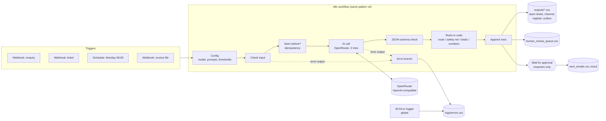

# AI workflow pack (n8n + AI)

Four n8n workflows that hand routine back-office work to an AI model (enquiries, support tickets, a weekly report and supplier invoices) while code checks every AI answer, a person approves anything customer-facing, and failures are logged rather than lost.

> **Status (8 October 2026): first version, generated by a coding agent from Sara's brief, not yet reviewed by Sara.** The workflows have run end to end in a local n8n (2.35.7) against a mock model. Accuracy with a real model is **pending a live run (needs an OpenRouter key)**.

## 1. Demo

- **Video:** pending. Sara will record it: each workflow on 2 inputs, with one error caught and one item sent to human approval.
- **Canvas screenshots** were taken from the local n8n editor (`docs/screenshots/`):

| Enquiry intake | Ticket triage |
|---|---|
|  |  |
| **Weekly AI report** | **Invoice or PDF to data** |
|  |  |

## 2. The problem

The company in this demo is **Lumi Skin**, a fictional mid-size skincare retailer in Dubai with an online shop and wholesale customers. Its operations team spends hours every week on four jobs:

- sorting the shared inbox and replying to it;
- triaging support tickets;
- building the Monday report;
- typing supplier invoices into a register.

An AI model can do much of this work, but only if a team can trust it:

- it must not send an email nobody checked;
- it must not invent a number in a management report;
- it must not book the same invoice twice;
- it must not drop a ticket because an API was down.

This pack shows one way to get the time savings with those safeguards. It is also written up so an operations team could run it: an SOP, a staff training guide and an hours-saved estimate.

## 3. What it does

1. **Enquiry intake.** An email arrives at a webhook.
   - The AI classifies it (sales, support, complaint, partnership or spam) and extracts the name, company, need, urgency and language as JSON.
   - Code routes it to a team "sheet".
   - The AI drafts a reply, and the draft **waits for a person**: n8n's Wait node resumes only when someone opens the approval link.
2. **Ticket triage.** The AI sets a priority (P1 to P4), a sentiment, a team and a summary.
   - A code **safety net** forces P1 for health, security, fraud and legal keywords, in Arabic, English and French.
   - P1 tickets are escalated immediately, even when the AI is down. Every ticket is posted to the team "channel".
3. **Weekly AI report.** On a Monday schedule (or a webhook call), code computes every number from the ticket and enquiry CSVs.
   - The AI writes only the narrative, using **placeholders** such as `{sla_breaches}`, and code fills in the values.
   - If the AI types a digit itself, the narrative is held for review.
4. **Invoice or PDF to data.** A PDF or text file is uploaded. n8n extracts the text and the AI extracts the fields.
   - **Code checks** that total = net + VAT, that VAT = net × rate, that the VAT rate is known, that no field is missing and that the invoice is not a duplicate.
   - Anything doubtful goes to a human-check queue.
5. **Every workflow** has these safeguards:
   - 3 tries on AI calls;
   - a JSON-schema check of the AI output;
   - idempotency, so the same input twice never creates two records;
   - an error branch writing to `logs/errors.csv`;
   - a global error-logger workflow for anything unexpected.
6. **A Python reference implementation** of the same rules (`src/workflow_pack/`) allows unit tests and evaluation. Tests run the JavaScript from the exported workflows and check it gives the same decisions.

## 4. Architecture



| Step | Who does it | Why |
|---|---|---|
| Reading messy text: category, fields, priority, sentiment, invoice fields | AI | Language understanding is what the model is for. Rules break on new wording (see the regex baseline below). |
| Routing, escalation, safety net, duplicate check | Code | These rules must be predictable, auditable and the same every time. |
| Every number in the weekly report | Code | A model can miscount. Here it never types a number. |
| Totals and VAT checks | Code | Arithmetic is cheap to check and expensive to get wrong. |
| Sending a reply | A person | Nothing customer-facing leaves without approval. |

More detail is in [docs/architecture.md](docs/architecture.md). The stack is n8n 2.35.7 (self-hosted), OpenRouter through n8n's OpenAI credential type, Python 3.11+ (jsonschema, pypdf, openai SDK) and pytest + ruff. Node.js is used only to test the exported Code-node JavaScript.

## 5. Results

**Measured on 8 October 2026 (no language model needed).** Command: `python -m evals.deterministic`. Evidence: [`evals/deterministic/results.md`](evals/deterministic/results.md).

| Check | Result |
|---|---|
| Weekly report: numbers computed in code vs generator ground truth, 50 weeks | **1200/1200** leaf values (Python), **1200/1200** (n8n JavaScript) |
| Weekly report: narrative check catches a typed wrong number / an invented metric | 50/50 / 50/50 |
| Invoices: validator on the printed fields; planted problems (wrong total, wrong VAT, missing field, duplicate) not booked | 14/14; and 36/36 clean invoices booked |
| Invoices: n8n JavaScript validator gives the same status as Python | 50/50 |
| Invoices: text extracted from the file (pypdf / UTF-8) | 50/50 |
| Invoices: **regex baseline** (no AI), all 8 fields correct | 19/50 (38%); routed correctly 25/50 |
| Enquiries: prompt-injection tripwire | flags 3/3 injections, 0/47 false alarms |
| Tickets: safety-net keywords alone | catch 7/8 true P1s, 0/42 false alarms |
| Keyword baselines (optimistic, see caveat): enquiry category / ticket priority | 45/50 / 49/50 |

Caveat: the keyword baselines and the labels were written by the same author, a coding agent, so the baseline scores are optimistic. They are a floor, not a benchmark.

**End-to-end run in real n8n (8 October 2026).**
- Set-up: n8n 2.35.7 on Node 22.22. The OpenRouter URL was replaced by a local mock model (`scripts/mock_llm_server.py`) that answers with the keyword baselines.
- Command: `python -m evals.run --target n8n --dry-run`. Evidence: [`evals/n8n_e2e/`](evals/n8n_e2e/README.md) and `evals/dry_run/`.
- These are **not model results**. They show that the workflows behave correctly:

| Check (all 4 workflows, 200 inputs) | Result |
|---|---|
| n8n decisions identical to the Python reference with the same model answers | **200/200** (rendered report files byte-identical) |
| Re-sent inputs stopped as duplicates | 20/20 (5 per workflow) |
| Injected API failures (3 tries each) written to `logs/errors.csv` and answered with HTTP 500 | 4/4 |
| Injected non-JSON AI answers sent to the human review queue | 4/4 |
| Enquiry replies sent without approval | 0; approval link → mock send logged: yes |
| Edge cases: missing body, missing ticket id, non-Monday week, `.csv` upload, corrupt PDF | all 5 logged with the right step |
| Same invoice re-sent as a different file (same supplier + number) | flagged as duplicate |
| Bug in a Code node, caught by the global error-logger workflow | logged |

**Pending live run (needs OpenRouter key):**

| Metric (denominator) | Result |
|---|---|
| Enquiry classification accuracy (50) and field accuracy (40 non-spam) | pending live run (needs OpenRouter key) |
| Ticket priority / sentiment / team accuracy (50), P1 recall (8) | pending live run (needs OpenRouter key) |
| Weekly report narratives passing the number check (50) | pending live run (needs OpenRouter key) |
| Invoice field accuracy (50) and human-review rate | pending live run (needs OpenRouter key) |
| Cost per run and per item | pending live run (needs OpenRouter key) |

To produce the pending numbers: `python -m evals.run --model cheap --limit 10`, then the full 200. Model IDs come from `MODEL_CHEAP` / `MODEL_MAIN` in `Portfolio Projects/.env`. Results and traces go to `evals/results/`.

## 6. What failed and what I changed

These problems were found during the first build (by the coding agent, on 8 October 2026). Notes are in [`evals/build_notes.md`](evals/build_notes.md).

- **The invoice test set was too easy.** At first every invoice used one fixed layout per language, and the regex baseline read 50/50 of them perfectly, so the set could not show what AI adds. The generator now uses 2–3 label layouts per language ("Inv #", "Amount due", "Net à payer", "المبلغ المستحق"…), and the baseline drops to 19/50 fully correct. The baseline rules were not changed afterwards.
- **The narrative number check was weak.** The first version accepted a narrative if every number in it appeared somewhere in the computed data. A test that changed one number caught only 17 of 50 bad narratives: a wrong value often equals some other count. The AI now writes placeholders and never types a digit, and the same test catches 50/50.
- **n8n details that broke the first run:**
  - "Convert to File" drops the JSON fields, so file paths are read through paired items (`$('Build output rows').item`).
  - The Crypto node drops binary data, so the uploaded invoice is re-attached in "Seen before?".
- **A failed item must stay retryable.** The idempotency key is released in the error branch. Otherwise a temporary API outage would turn the retry into a "duplicate".

> TODO (Sara): after reviewing and running the project, list what you changed and why. Do not claim changes you have not made.

## 7. How to run

```bash
uv venv --python 3.13 .venv && uv pip install --python .venv -e ".[dev]"   # or: python -m venv .venv && pip install -e ".[dev]"
.venv/bin/pytest -q && .venv/bin/ruff check .                                 # 82 tests, no network
.venv/bin/python -m evals.deterministic                                       # real numbers that need no model
.venv/bin/python -m evals.run --dry-run                                       # whole pipeline with the fake model (NOT results)
.venv/bin/python -m evals.run --model cheap --limit 10                        # live run: needs OPENROUTER_API_KEY in Portfolio Projects/.env
```

**To run the workflows in n8n**, follow [docs/n8n_setup.md](docs/n8n_setup.md) (about 10 minutes, with or without an API key). In short:
1. Run `python scripts/prepare_workflows.py`.
2. Start n8n with Docker or `npx n8n@2.35.7`.
3. Add one credential named "OpenRouter (OpenAI-compatible)".
4. Import `build/n8n/*.json` and publish the workflows.
5. Run `python -m evals.run --target n8n`.

The approval inbox demo (`app/approval_inbox.py`, Gradio) lists the drafts waiting for approval and the review queue: `pip install -e ".[app]" && python app/approval_inbox.py`.

## 8. Data and licence

- **All data is synthetic and fictional.** "Lumi Skin", the suppliers and the customers do not exist. Emails use `@example.com` and phone numbers `+971 50 000 xxxx`.
  - The 50 enquiries and 50 tickets (English, Arabic, French and mixed, including typos, spam and 3 prompt injections) were written by a coding agent with labels. Sara has not reviewed them yet.
  - The 50 invoices (38 PDF, 12 text) and the weekly-report CSVs come from `data/generate.py` (seed 42), with planted problems.
  - See [data/README.md](data/README.md).
- **Code:** MIT licence, © 2026 Sara Hebbadj (see `LICENSE`).
- **n8n** is not included in this repository. It is distributed under the [Sustainable Use License](https://docs.n8n.io/sustainable-use-license/), a fair-code licence that allows free use for internal business purposes and personal or non-commercial projects. This demo is a personal, non-commercial use. Offering n8n itself as a paid hosted service would need a commercial agreement with n8n. The workflow JSON files in `workflows/` are this project's own work.

## 9. How I used AI agents

> **DRAFT for Sara: edit before publishing.**

- Sara set the brief and the acceptance tests in `BUILD_SPEC.md`. These were the four workflows, error handling in every workflow, 50 labelled inputs per workflow, the SOP, the training guide and the hours-saved sheet.
- A coding agent (Claude) generated the first version of everything in this repository on 8 October 2026:
  - the workflows and their generator;
  - the Python reference;
  - the data;
  - the tests;
  - the evaluation runner;
  - the documents.
- The agent also ran n8n locally to check the workflows. It recorded the problems it found in section 6.
- Sara will review, run and change the code, and explain every file.

> TODO (Sara): describe what you reviewed, what you ran yourself, and what you changed.

## 10. Limitations and next steps

- **No live-model numbers yet.** OpenRouter was not reachable from the build environment. Every AI accuracy figure is pending.
- **Small, self-written test sets.** There are 50 inputs per workflow, written or generated by the same agent that wrote the rules. Next step: a held-out set written by someone else (Sara), and a second labeller to measure agreement.
- **Self-reported confidence.** The confidence values are the model's own and are not calibrated. Only the code checks are hard guarantees.
- **Mock systems.** The "sheets", the "channel" and the email outbox are CSV files. Production would swap the write nodes for Google Sheets, Slack/Teams and Gmail/Outlook nodes, which needs accounts.
- **Idempotency limits.** Keys live in n8n workflow static data. That works for single-instance demos but is saved only for production executions, and two simultaneous identical requests could race. Production would use a database with a unique key.
- **No OCR yet.** Scanned PDFs with no text layer go to human review ("no text found").
- **Next steps:**
  - run the live evaluation and record cost per item;
  - connect the n8n connector in Claude to trigger workflows from chat;
  - add a free CRM sandbox node;
  - add a WhatsApp Business test number (sandbox only).
