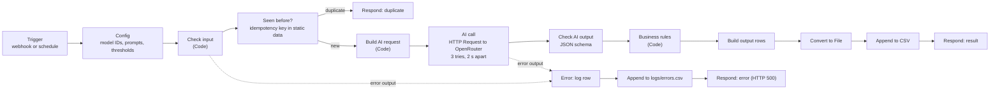

# Architecture

## The shared pattern

All four workflows follow the same steps, so a reviewer only has to learn one shape.

- **Expected failures** go through each node's *error output* to the red error branch:
  - bad input;
  - the AI API failing after 3 tries;
  - a corrupt PDF;
  - a CSV that cannot be read.

  The branch writes one row to `logs/errors.csv`, **releases the idempotency key** so the same input can be retried, and answers HTTP 500.
- **Unexpected failures**, such as a bug in a Code node, are caught by the separate workflow `00 Error logger (global)`. It is set as every workflow's *Error Workflow* and writes to the same file.
- **Idempotency** works in two layers:
  - an input key: `message_id`, `ticket_id`, `week_start` or the SHA-256 of the uploaded file;
  - for invoices, a business key: supplier + invoice number, so the same invoice in a different file is still caught.
- **Human review**: anything that fails a check goes to the shared `outputs/human_review_queue.csv`, which staff work from. This covers schema failures, low confidence, possible prompt injection, invoice problems and a narrative with typed numbers.

## The four workflows

```mermaid
flowchart TB
    subgraph E["01 Enquiry intake"]
        e1["AI: classify + extract"] --> e2{"Route (code)"}
        e2 -- "sales / support / complaint / partnership" --> e3["AI: draft reply"] --> e4["Team sheet row<br/>status pending_approval"] --> e5["Wait for approval<br/>(resume link)"] --> e6["Mock send<br/>sent_emails.csv"]
        e2 -- "spam" --> e7["Archive, no reply"]
        e2 -- "injection / low confidence / bad JSON" --> e8["Human review queue"]
    end
    subgraph T["02 Ticket triage"]
        t1["Safety net (code)"] --> t2["AI: priority, sentiment, team"] --> t3{"P1?"}
        t3 -- yes --> t4["Escalation alert<br/>escalations.csv"] --> t5["Channel post"]
        t3 -- no --> t5
        t2 -. "AI down + safety keyword" .-> t4
    end
    subgraph R["03 Weekly report"]
        r1["Read CSVs"] --> r2["Compute numbers (code)"] --> r3["AI: narrative with placeholders"] --> r4{"Typed digits or<br/>unknown placeholders?"}
        r4 -- no --> r5["Fill placeholders, render MD + HTML<br/>mock email"]
        r4 -- yes --> r6["Numbers only, narrative held for review"]
    end
    subgraph I["04 Invoice to data"]
        i1["Hash file, dedupe"] --> i2["Extract text<br/>PDF or .txt"] --> i3["AI: fields"] --> i4{"Totals, VAT, rate,<br/>missing, duplicate (code)"}
        i4 -- ok --> i5["Invoice register: accepted"]
        i4 -- problem --> i6["Human-check queue"]
    end
```

## What is AI and what is code

| Workflow | AI decides | Code decides |
|---|---|---|
| Enquiry intake | category, name, company, need, urgency, language; draft text | team, spam archive, manager CC flag, injection hold, low-confidence hold, never sending without approval |
| Ticket triage | priority, sentiment, team, summary | safety-net override to P1, immediate escalation, low-confidence hold |
| Weekly report | the wording of the narrative | every number, the check that the AI typed no digits, the table, the email |
| Invoices | reading the fields from text | total = net + VAT, VAT = net × rate (±0.01), known VAT rates per currency, missing fields, duplicates, confidence threshold |

## Single sources of truth

- **Prompts:** `prompts/*.md`, loaded by Python and copied into each workflow's Config node by `scripts/build_workflows.py`.
- **Output schemas:** `schemas/*.json`. Python checks them with `jsonschema`, and a small validator embedded in the Code nodes does the same.
- **Rule tables:** safety keywords, injection patterns, teams, VAT rates, SLA minutes and CSV columns are Python constants injected into the JavaScript at build time.
- **Code node JavaScript:** `workflows/code/`. `tests/test_js_parity.py` runs it with Node.js against the Python reference.

## Components

| Path | What it is |
|---|---|
| `workflows/*.json` | n8n exports (import these) |
| `workflows/code/` | JavaScript for the Code nodes (readable source) |
| `scripts/build_workflows.py`, `scripts/n8n_nodes.py` | Build the workflow JSON from the sources above |
| `scripts/prepare_workflows.py` | Fill the Config nodes from `.env`; create the CSV headers |
| `scripts/mock_llm_server.py` | OpenAI-compatible mock for testing without a key |
| `src/workflow_pack/` | Python reference: `enquiry.py`, `triage.py`, `report.py`, `invoice.py`; `llm.py` (the only model client), `fake_llm.py`, `baselines.py`, `common.py`, `config.py` |
| `evals/run.py` | Evaluation runner (Python or n8n target, live or dry run) |
| `evals/deterministic.py` | Checks that need no model |
| `app/approval_inbox.py` | Gradio page for approving drafts and viewing the review queue |
